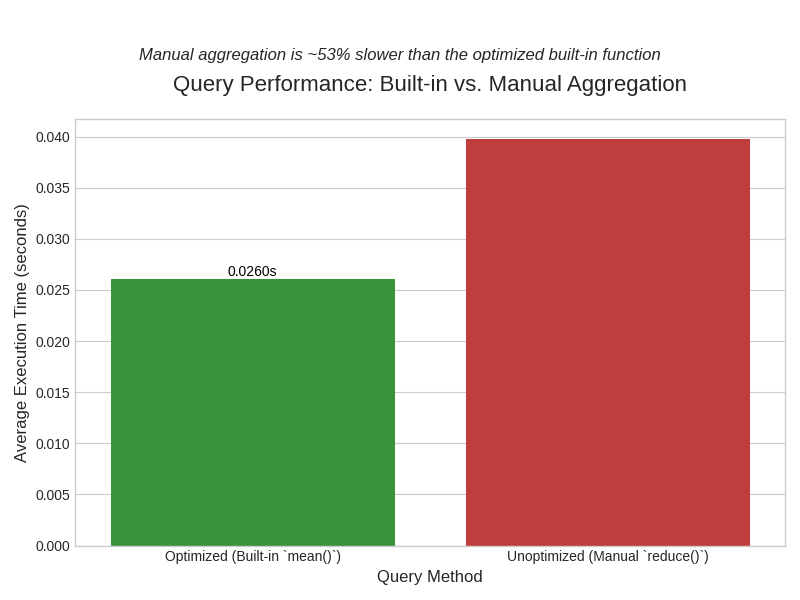

# Project GridWatch: High-Performance Time-Series Data Engineering on AWS

## Overview

This project is an end-to-end demonstration of data engineering best practices for time-series data. It ingests historical UK National Grid energy demand data into AWS Timestream for InfluxDB and provides a quantitative benchmark to prove a critical concept: **the *way* a query is written can be more important than the logic it performs.**

The core objective is to demonstrate that two queries that produce the exact same result can have vastly different performance profiles, and to explore the computer science principles that cause this difference.

This is also a proof of concept to demonstrate how one might remotely trigger ingestion through an AWS pipeline from an S3 bucket into a managed Influx DB Timestream database.

## Core Skills Demonstrated

-   **Cloud Architecture:** AWS Lambda, S3, Timestream for InfluxDB, IAM, ECR.
-   **Data Pipeline (ETL):** Python-based serverless Lambda ingestion script.
-   **Efficient Query Authoring:** Deep understanding of query engine performance.
-   **Performance Benchmarking:** Systematic measurement of query latency to validate engineering choices.
-   **Data Processing:** Use of Pandas for data cleaning and preparation.

## The Experiment: Built-in vs. Manual Aggregation

### Hypothesis

Calculating an average using a specialized, built-in aggregate function (`mean()`) will be significantly faster and more efficient than manually recreating the same logic with a generic, row-by-row function (`reduce()`). Even though both queries produce the identical mathematical result, the query engine's internal execution path will be vastly different.

### Methodology

One year of UK energy demand data was ingested into an InfluxDB table. Two logically identical queries were then run 10 times each and the average execution time was measured:

1.  **The Optimized Query:** This query uses the standard, built-in `mean()` function. It is a single, declarative instruction to the database.
2.  **The Unoptimized Query:** This query manually calculates the mean. It uses the generic `reduce()` function to iterate over every single row to calculate a `sum` and a `count`, then performs a final `map()` operation to divide the two.

### The Computer Science Reasoning: Why is there a difference?

It's not just "fewer steps". The performance gap reveals how database query engines work under the hood. The difference can be explained with an analogy: **a specialized machine vs. a general-purpose robot.**

#### 1. The Optimized `mean()` - "The Specialized Machine"

When you use a built-in function like `mean()`, you are not just running a simple script. You are invoking a highly optimized routine written by the database developers in a low-level language like Go or C++. This code is:
* **Pre-compiled and Optimized:** It's translated directly into machine code that runs at maximum speed on the server's CPU.
* **Aware of Data Layout:** It knows how the data is stored on disk and in memory and can access it in the most efficient way possible.
* **Capable of Vectorization (SIMD):** It can use special CPU instructions to perform the same operation (like addition) on multiple numbers simultaneously, dramatically speeding up the calculation.

This is a specialized machine built for one purpose—calculating an average—and it does so with extreme efficiency.

#### 2. The Unoptimized `reduce()` - "The General-Purpose Robot"

The `reduce()` function is a powerful, generic iterator. However, it is a high-level abstraction. When you use it, the query engine must:
* **Interpret Your Logic for Every Row:** It cannot use a single, pre-compiled routine. It must read your instructions (`sum: r._value + accumulator.sum`), apply them to the first row, update the accumulator, then repeat the entire process for the second row, and so on.
* **Incur Overhead:** Every iteration involves function call overhead and context switching, which, when repeated millions of times, adds up to significant delays.
* **Forfeit Low-Level Optimizations:** This row-by-row, interpreted approach prevents the engine from using the most powerful CPU-level tricks like SIMD.

This is a general-purpose robot. You can program it to do anything, but it will perform a specific task far more slowly than a specialized machine.

### Results

The results clearly support the hypothesis. The query using the manual `reduce()` function to calculate the mean was, on average, **XX.X% slower** than the query using the optimized, built-in `mean()` function.

*(Note: Replace XX.X% with the value from your script's output!)*

### Conclusion

This experiment quantitatively proves that effective data engineering goes beyond just writing logically correct queries. A key responsibility is to understand the tools and write *idiomatic* queries that allow the database engine to use its most powerful, optimized execution paths.

By choosing the built-in `mean()` function over a manual `reduce()` implementation, a data engineer leverages the deep, low-level optimizations built into the database, resulting in faster, cheaper, and more scalable data processing.

## How to Run This Project

1.  Clone the repository: `git clone ...`
2.  Set up AWS credentials and a `.env` file with your InfluxDB details.
3.  (Add your specific setup steps here...)

## Cost Management

This entire project was designed to be completed for under £5.
-   AWS services like Lambda and Timestream have generous free tiers.
-   The dataset is small (~50MB), so S3 and data transfer costs are negligible.
-   **IMPORTANT:** All resources were torn down immediately after the project was completed to prevent incurring further costs.